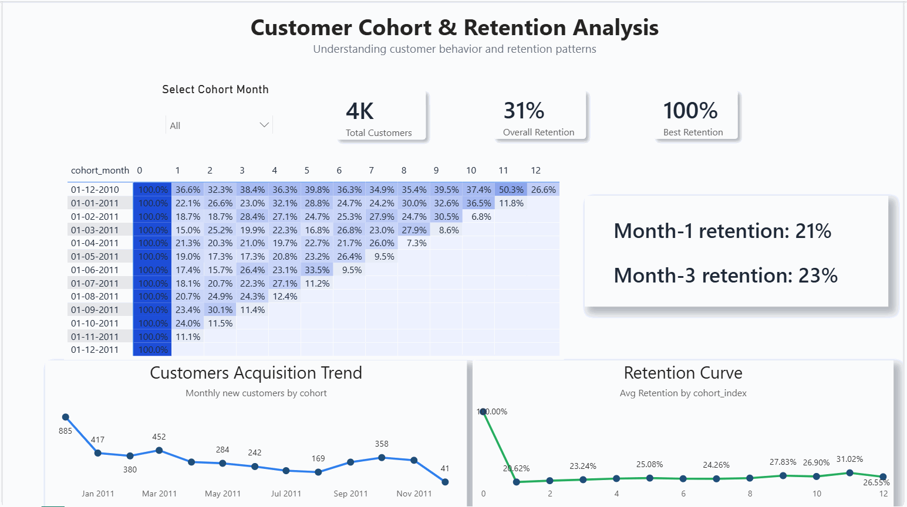

# Customer Cohort & Retention Analysis

## Project Overview

Understanding how customers return over time is essential for measuring product engagement and business growth.
This project performs **customer cohort analysis** using transactional retail data to evaluate **customer retention patterns, acquisition trends, and cohort performance**.

The analysis identifies how well customer groups (cohorts) retain over time and reveals behavioral patterns that can help businesses improve retention strategies.

---

## Dashboard Preview

### Customer Cohort Retention Dashboard



---

## Key Business Questions

This analysis answers several important questions:

* How many customers return after their first purchase?
* How does retention change over time for different customer cohorts?
* Which acquisition months brought the most valuable customers?
* At which month does retention drop the most?

These insights help organizations understand **customer lifecycle behavior and long-term engagement trends**.

---

## Dataset

The dataset used for this project is the **Online Retail Dataset**, which contains transactional records from a UK-based e-commerce company.

**Key fields include:**

* InvoiceNo
* StockCode
* Description
* Quantity
* InvoiceDate
* UnitPrice
* CustomerID
* Country

After cleaning and preprocessing, the dataset was used to build cohort groups based on **customer first purchase month**.

---

## Tools & Technologies

| Tool       | Purpose                                   |
| ---------- | ----------------------------------------- |
| Python     | Data cleaning and preprocessing           |
| PostgreSQL | Cohort analysis transformation            |
| Power BI   | Data visualization and dashboard creation |

---

## Analysis Process

### 1 Data Cleaning

Using **Python (Pandas)**:

* Removed rows with missing customer IDs
* Removed cancelled transactions
* Removed negative quantities and invalid prices
* Exported cleaned dataset for analysis

---

### 2 Cohort Analysis (SQL)

Using PostgreSQL:

* Calculated **customer first purchase month**
* Assigned **cohort month**
* Calculated **cohort index (months since first purchase)**
* Aggregated customer counts per cohort

This produced a dataset used to build retention matrices.

---

### 3 Power BI Dashboard

The dashboard includes:

#### Cohort Retention Heatmap

Shows how customer retention changes across different cohorts over time.

#### Customer Acquisition Trend

Displays how many new customers were acquired each month.

#### Retention Curve

Shows the average retention trend across all cohorts.

#### KPI Metrics

* Total Customers
* Overall Retention
* Best Retention Month

---

## Key Insights

* Customer retention drops significantly after the **first month**, which is typical in many e-commerce businesses.
* Some cohorts demonstrate **stronger retention patterns**, suggesting better acquisition quality.
* The retention curve stabilizes after several months, indicating a core group of loyal customers.

These insights can help businesses improve **customer onboarding, engagement, and retention strategies**.

---

## Repository Structure

```
customer-cohort-retention-analysis
│
├── data
│   └── online_retail_clean.csv
│
├── sql
│   └── cohort_analysis.sql
│
├── powerbi
│   └── cohort_retention_dashboard.pbix
│
├── images
│   ├── dashboard_overview.png
│   ├── cohort_heatmap.png
│   └── retention_curve.png
│
└── README.md
```

---

## Dashboard Features

The Power BI dashboard provides:

* Interactive cohort filtering
* Visual retention heatmap
* Customer acquisition trends
* Retention performance metrics

This enables quick identification of **customer lifecycle behavior and engagement patterns**.

---

## Skills Demonstrated

* Data Cleaning
* SQL Analytics
* Cohort Analysis
* Customer Retention Analysis
* Business Intelligence
* Power BI Dashboard Development
* Data Storytelling

---

## Author

**Shubhangi Pawar**
Data Analyst | SQL | Power BI | Tableau | Python
